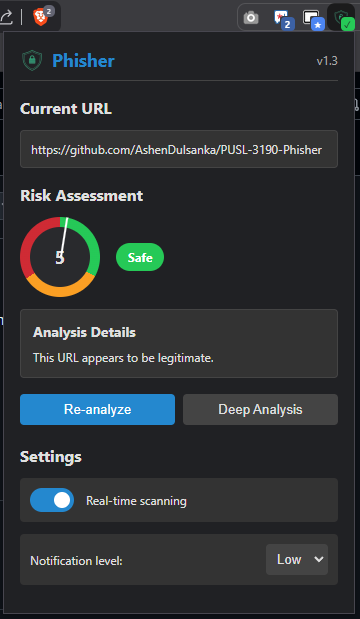

# Phisher 

AI-Powered Phishing Detection System that combines browser extension and Web Application technologies to detect and analyze phishing URLs.

## Features

- Browser extension with lightweight phishing detection (Random Forest classifier)
- Web Application for deep URL analysis (Gradient Boosting classifier)
- Real-time URL analysis and threat scoring
- Educational feedback to users about potential threats
- Admin dashboard with model metrics and system logs

## Components

- **Browser Extension**: Provides real-time URL analysis
- **Extension Backend**: Serves the browser extension with API endpoints
- **Deep Analysis Backend**: Performs deep analysis of suspicious URLs
- **Database**: Stores URLs, analysis results, and system logs
- **Web Interface**: Provides URL analysis and educational content

## Tech Stack

- **Frontend**: React.js, Material UI, Chrome Extensions API
- **Backend**: Python, FastAPI, PostgreSQL, Prisma
- **AI/ML**: Scikit-learn (Random Forest & Gradient Boosting Classifiers)
- **Infrastructure**: Docker, Google Cloud Platform

## Setup Instructions

### Prerequisites

- Docker and Docker Compose
- Node.js and npm
- Python 3.13+
- Chrome or compatible browser

### Docker Setup

1. Clone the repository:
   ```bash
   https://github.com/AshenDulsanka/PUSL-3190-Phisher
   cd PUSL-3190-Phisher
   ```

2. Build and start the container:
   ```bash
    docker-compose up -d
   ```

### Browser Extension Setup

1. Navigate to Chrome Extension (chrome://extensions/)
2. Enable Developer Mode
3. Click "Load unpacked"
4. Select the `browser_extension` directory

## Usage

### Browser Extension

- The extension monitors URLs in real-time and displays a warning when a potential phishing site is detected.
- Settings can be adjusted by clicking the extension icon:
  - Toggle real-time scanning
  - Set notification level (Low/High)
- For suspicious URLs, the extension will show either: 
  - A small notification (for lower threat scores)
  - A full-screen warning overlay (for high threat scores with high notification level)



### Web Interface

1. Visit the application at `http://localhost:3000`
2. Enter a URL in the analysis field
3. View detailed results including:
    - Threat score
    - Detected risk factors
    - Educational information about phishing protection


### Admin Dashboard

1. Access the admin panel at `http://localhost:3000/admin`
2. Manually populate the `admin` table with the administrator’s credentials in the database, then login with it.
3. Available sections:
    - Dashboard: Overview of system performance
    - Phishing Detections: List of detected phishing URLs
    - Model Statistics: ML model performance metrics and evaluations
    - System Logs: Detailed system activity logs


## License

This project is licensed under the MIT License - see the <a href="LICENSE">LICENSE</a> file for details.

## Contributing

If you want to contribute to this project, feel free to open an issue or submit a pull request.